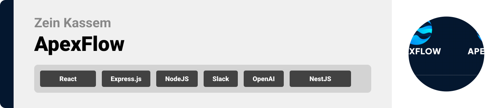
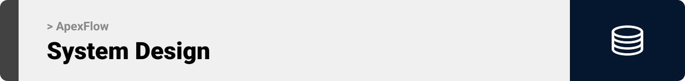
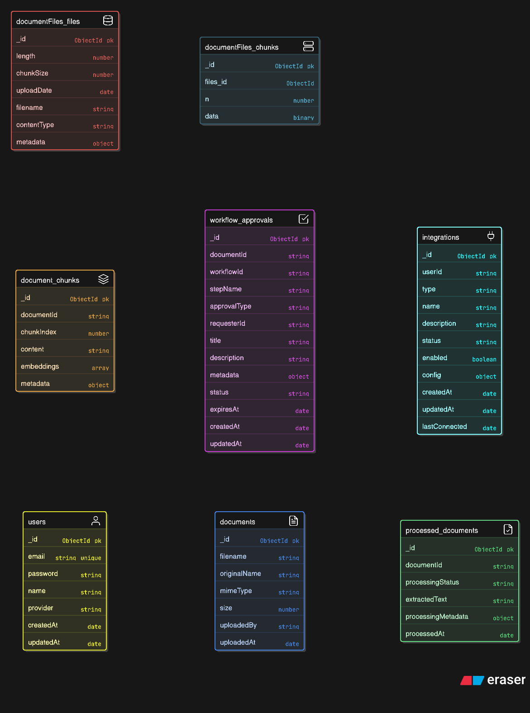
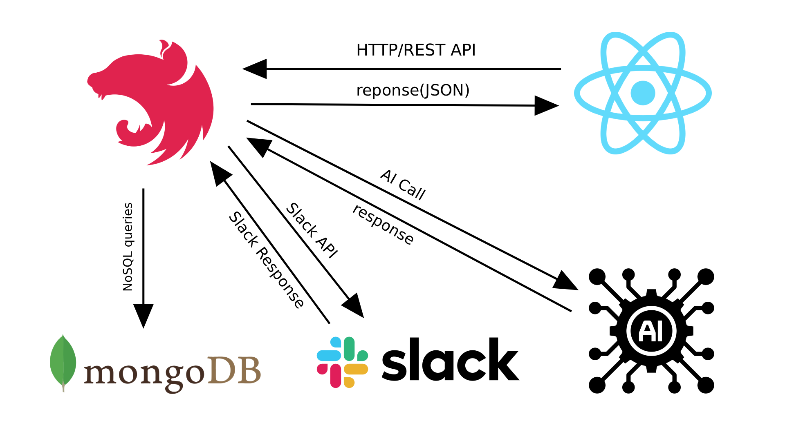
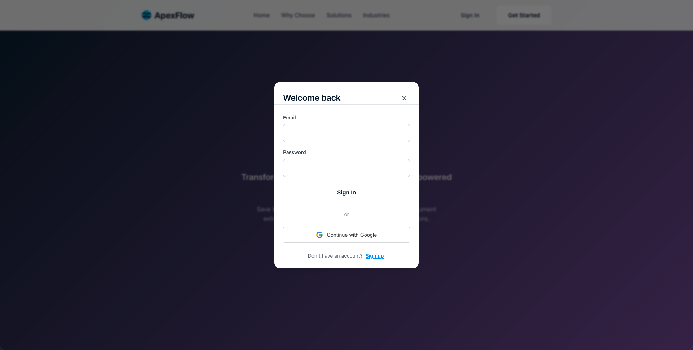
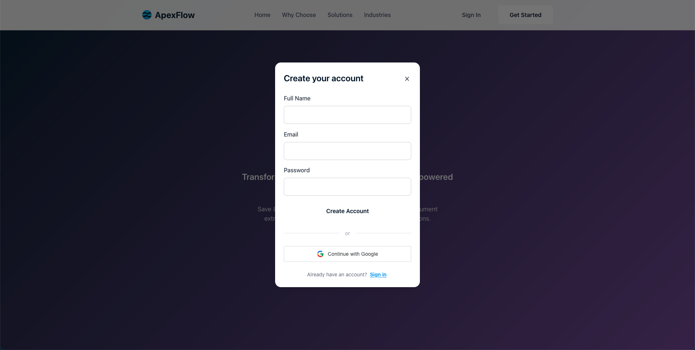
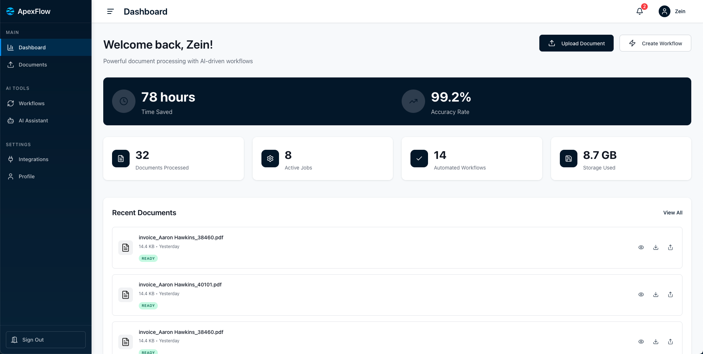
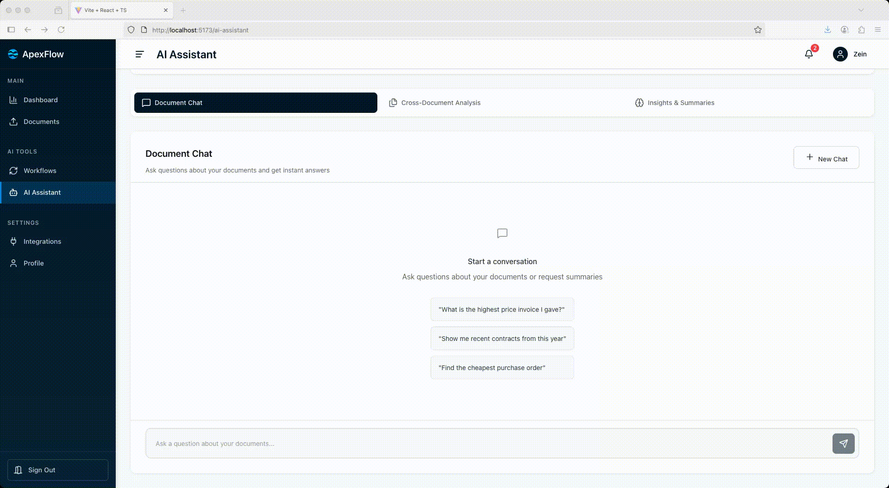
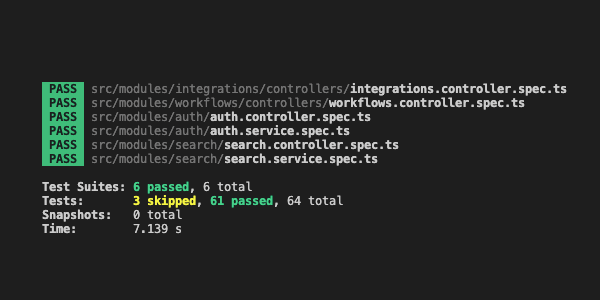
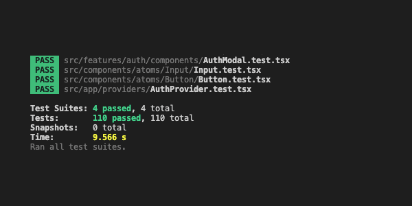

<!-- CI/CD Pipeline Status: Testing CD trigger after fixing major lint errors -->

<br><br>

<!-- project overview -->


## ApexFlow

A comprehensive AI-powered document processing and workflow automation platform designed to revolutionize how organizations handle document-intensive business processes.

Built with a modern microservices architecture, ApexFlow combines advanced AI capabilities including OCR, natural language processing, and machine learning to extract, analyze, and process documents intelligently. The platform features seamless integrations with popular tools like Slack, robust workflow automation, and an intuitive React-based interface for managing documents and approvals.

<br><br>

<!-- System Design -->


## ER Diagram



## System Architecture



### Add Title Here

- To be decided on later on.

<br><br>

<!-- Project Highlights -->


### 🚀 Key AI Features

## 🎯 **Feature 1: AI Document Analysis**

**Intelligent Document Processing & Data Extraction**

- **📄 OCR Text Extraction** - Extracts text from PDFs and images using Tesseract OCR
- **🤖 AI-Powered Analysis** - Uses HuggingFace AI models for intelligent data extraction
- **💰 Invoice Processing** - Automatically extracts vendor info, amounts, dates, and line items
- **🔍 Entity Recognition** - Finds emails, phone numbers, financial amounts, and dates
- **📁 Document Classification** - Identifies document types (PDF, Word, Invoice, Contract)
- **⚡ Real-time Processing** - Instant analysis with confidence scoring

**Example Output:**

```json
{
  "invoiceNumber": "INV-12345",
  "vendor": { "name": "TechCorp", "amount": "$1,500.00" },
  "confidence": 0.95,
  "extractedText": "Full document text...",
  "structuredFields": {...}
}
```

---

## 🎯 **Feature 2: AI Chat Bot**

**Natural Language Document Search & Conversation**

- **💬 Smart Document Chat** - Ask questions about your documents in natural language
- **🔍 Intelligent Search** - Query like "What is the highest price invoice?" or "Show me recent contracts"
- **🎯 Context Awareness** - Understands intent (find highest, count documents, compare)
- **📊 Relevance Scoring** - Returns results ranked by relevance with confidence scores
- **📚 Source References** - Provides answers with document sources and page references
- **💡 Suggested Questions** - Pre-built queries like "Find cheapest purchase order"

**Example Conversations:**

```
User: "What is the highest price invoice I have?"
Bot: "I found the highest priced document: Invoice #12345 for $5,000.00
      from TechCorp dated June 2024."

User: "Show me recent contracts"
Bot: "You have 3 contracts from this year: TechCorp Contract ($15K),
      Legal Services Agreement ($8K)..."
```

**Chat Features:**

- ✨ Real-time typing indicators
- 🎯 Contextual responses with document sources
- 💾 Session management and chat history
- 🚀 Instant search across all uploaded documents

<br><br>

<!-- Demo -->


### User Screens

| Login screen                               | Register screen                             |
| ------------------------------------------ | ------------------------------------------- |
|  |  |

### Admin Screens (Web)

| Dashboard                                      | Upload Document                         |
| ---------------------------------------------- | --------------------------------------- |
|  |  |

| Workflows                              | AI assistant                            |
| -------------------------------------- | --------------------------------------- |
|  |  |

| Integrations                          |
| ------------------------------------- |
|  |

<br><br>

<!-- Development & Testing -->


### Services, Validation and Testing

| Testing Backend                                | Testing Frontend                              |
| ---------------------------------------------- | --------------------------------------------- |
|  |  |

| Services                                | Validation                            |
| --------------------------------------- | ------------------------------------- |
|  |  |

<br><br>

<!-- Deployment


### Add Title Here

- Description here.

| Postman API 1                           | Postman API 2                         | Postman API 3                         |
| --------------------------------------- | ------------------------------------- | ------------------------------------- |
|  |  |  |

<br><br> -->
